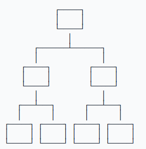

# 数据模型

数据库按照数据结构来组织、存储和管理数据，实际上，数据库一共有三种模型：

- 层次模型
- 网状模型
- 关系模型

层次模型就是以“上下级”的层次关系来组织数据的一种方式，层次模型的数据结构看起来就像一颗树：

网状模型把每个数据节点和其他很多节点都连接起来，它的数据结构看起来就像很多城市之间的路网：

关系模型把数据看作是一个二维表格，任何数据都可以通过行号 + 列号来唯一确定，它的数据模型看起来就是一个 Excel 表：

随着时间的推移和市场竞争，最终，基于关系模型的关系数据库获得了绝对市场份额。

为什么关系数据库获得了最广泛的应用？

因为相比层次模型和网状模型，关系模型理解和使用起来最简单。

我们以学校班级为例，一个班级的学生就可以用一个表格存起来，并且定义如下：

| ID  | 姓名 | 班级 ID | 性别 | 年龄 |
| --- | ---- | ------- | ---- | ---- |
| 1   | 小明 | 201     | M    | 9    |
| 2   | 小红 | 202     | F    | 8    |
| 3   | 小军 | 202     | M    | 8    |
| 4   | 小白 | 201     | F    | 9    |

其中，班级 ID 对应着另一个班级表：

| ID  | 名称       | 班主任       |
| --- | ---------- | ------------ |
| 201 | 二年级一班 | 王老师       |
| 202 | 二年级二班 | 李老师  |

通过给定一个班级名称，可以查到一条班级记录，

根据班级ID，又可以查到多条学生记录，

这样，二维表之间就通过ID映射建立了“一对多”关系。

# 数据类型

对于一个关系表，除了定义每一列的名称外，还需要定义每一列的数据类型。关系数据库支持的标准数据类型包括数值、字符串、时间等：

| 名称         | 类型           | 说明                                                                                       |
| ------------ | -------------- | ------------------------------------------------------------------------------------------ |
| INT          | 整型           | 4 字节整数类型，范围约 +/-21 亿                                                            |
| BIGINT       | 长整型         | 8 字节整数类型，范围约 +/-922 亿亿                                                         |
| REAL         | 浮点型         | 4 字节浮点数，范围约 +/-1038                                                    |
| DOUBLE       | 浮点型         | 8 字节浮点数，范围约 +/-10308                                                   |
| DECIMAL(M,N) | 高精度小数     | 由用户指定精度的小数，例如，DECIMAL(20,10)表示一共 20 位，其中小数 10 位，通常用于财务计算 |
| CHAR(N)      | 定长字符串     | 存储指定长度的字符串，例如，CHAR(100)总是存储 100 个字符的字符串                           |
| VARCHAR(N)   | 变长字符串     | 存储可变长度的字符串，例如，VARCHAR(100)可以存储 0\~100 个字符的字符串                     |
| BOOLEAN      | 布尔类型       | 存储 True 或者 False                                                                       |
| DATE         | 日期类型       | 存储日期，例如，2018-06-22                                                                 |
| TIME         | 时间类型       | 存储时间，例如，12:20:59                                                                   |
| DATETIME     | 日期和时间类型 | 存储日期 + 时间，例如，2018-06-22 12:20:59                                                 |

上面的表中列举了最常用的数据类型。

很多数据类型还有别名，例如，`REAL` 又可以写成 `FLOAT(24)`。

还有一些不常用的数据类型，例如，`TINYINT`（范围在 0\~255）。

各数据库厂商还会支持特定的数据类型，例如 `JSON`。

选择数据类型的时候，要根据业务规则选择合适的类型。

通常来说，`BIGINT` 能满足整数存储的需求，`VARCHAR(N)` 能满足字符串存储的需求，这两种类型是使用最广泛的。

# 主流关系数据库

目前，主流的关系数据库主要分为以下几类：

1. 商用数据库，例如：[Oracle](https://www.oracle.com/)，[SQL Server](https://www.microsoft.com/sql-server/)，[DB2](https://www.ibm.com/db2/) 等；
2. 开源数据库，例如：[MySQL](https://www.mysql.com/)，[PostgreSQL](https://www.postgresql.org/) 等；
3. 桌面数据库，以微软 [Access](https://products.office.com/access) 为代表，适合桌面应用程序使用；
4. 嵌入式数据库，以 [Sqlite](https://sqlite.org/) 为代表，适合手机应用和桌面程序。

# SQL

什么是 SQL？

SQL 是结构化查询语言的缩写，用来访问和操作数据库系统。

SQL 语句既可以查询数据库中的数据，也可以添加、更新和删除数据库中的数据，还可以对数据库进行管理和维护操作。

不同的数据库，都支持 SQL，这样，我们通过学习 SQL 这一种语言，就可以操作各种不同的数据库。

总的来说，SQL 语言定义了这么几种操作数据库的能力：

#### DDL：Data Definition Language

DDL 允许用户定义数据，也就是创建表、删除表、修改表结构这些操作。通常，DDL 由数据库管理员执行。

#### DML：Data Manipulation Language

DML 为用户提供添加、删除、更新数据的能力，这些是应用程序对数据库的日常操作。

#### DQL：Data Query Language

DQL 允许用户查询数据，这也是通常最频繁的数据库日常操作。

# 语法特点

SQL语言关键字不区分大小写！！！

但是，针对不同的数据库，对于表名和列名，有的数据库区分大小写，有的数据库不区分

大小写。同一个数据库，有的在Linux上区分大小写，有的在Windows上不区分大小写。
