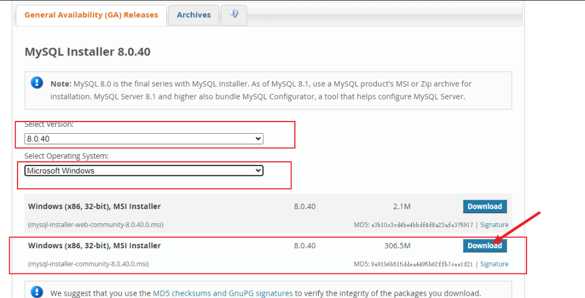
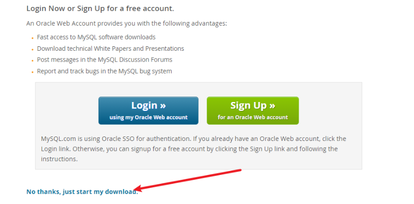
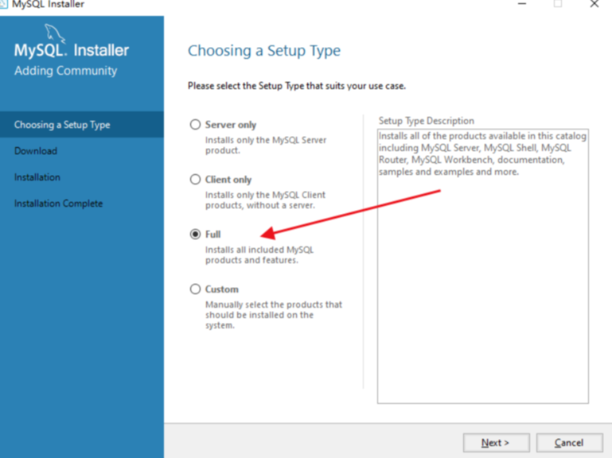
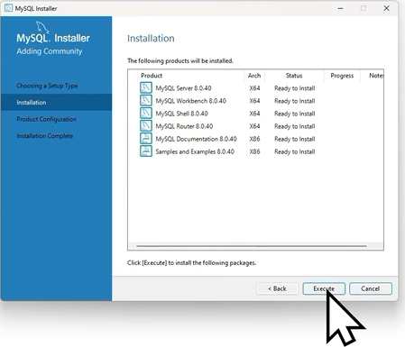
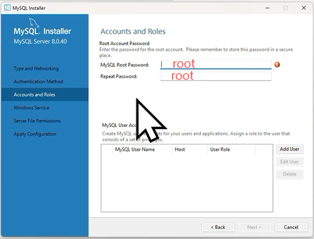
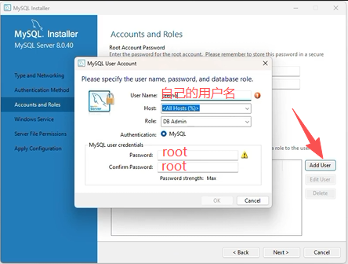
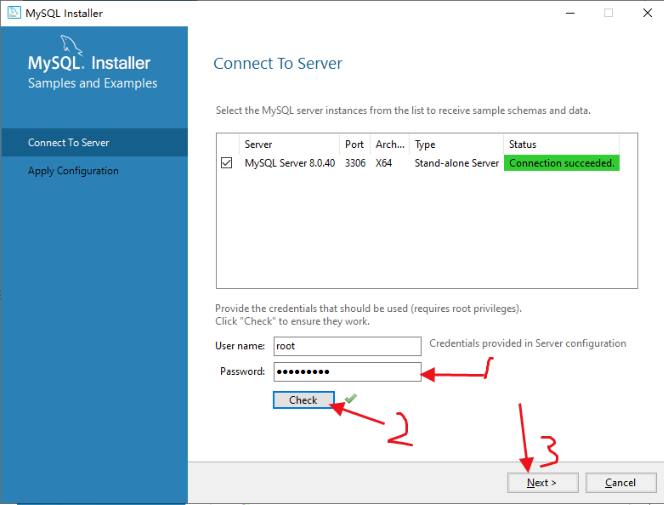
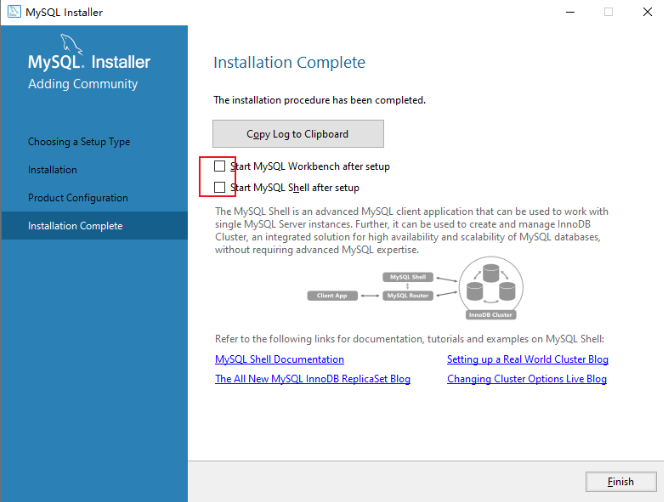

// 安装 MySQL

# MySQL背景

MySQL 是目前应用最广泛的开源关系数据库。MySQL 最早是由瑞典的 MySQL AB 公司开发，该公司在 2008 年被 SUN 公司收购，紧接着，SUN 公司在 2009 年被 Oracle 公司收购，所以 MySQL 最终就变成了 Oracle 旗下的产品。

# MySQL 接口和数据库引擎

和其他关系数据库有所不同的是，MySQL 本身实际上**只是一个 SQL 接口**，

它的内部还包含了多种数据引擎，常用的包括：

- InnoDB：由 Innobase Oy 公司开发的一款支持事务的数据库引擎，2006 年被 Oracle 收购；
- MyISAM：MySQL 早期集成的默认数据库引擎，不支持事务。

MySQL 接口和数据库引擎的关系就好比某某浏览器和浏览器引擎（IE 引擎或 Webkit 引擎）的关系。

对用户而言，切换浏览器引擎不影响浏览器界面，切换 MySQL 引擎不影响自己写的应用程序使用 MySQL 的接口。

使用 MySQL 时，不同的表还可以使用不同的数据库引擎。

如果你不知道应该采用哪种引擎，记住总是选择 _InnoDB_ 就好了。

# 基于MySQL衍生出的各种版本

因为 MySQL 一开始就是开源的，所以基于 MySQL 的开源版本，又衍生出了各种版本：

### MariaDB

由 MySQL 的创始人创建的一个开源分支版本，使用 XtraDB 引擎。

### Aurora

由 Amazon 改进的一个 MySQL 版本，专门提供给在 AWS 托管 MySQL 用户，号称 5 倍的性能提升。

### PolarDB

由 Alibaba 改进的一个 MySQL 版本，专门提供给在阿里云托管的 MySQL 用户，号称 6 倍的性能提升。

### MySQL 官方版本

而 MySQL 官方版本又分了好几个版本：

- Community Edition：社区开源版本，免费；
- Standard Edition：标准版；
- Enterprise Edition：企业版；
- Cluster Carrier Grade Edition：集群版。

以上版本的功能依次递增，价格也依次递增。

不过，功能增加的主要是监控、集群等管理功能，对于基本的 SQL 功能是完全一样的。

所以使用 MySQL 就带来了一个巨大的好处：可以在自己的电脑上安装免费的 Community Edition 版本，进行学习、开发、测试。

部署的时候，可以选择付费的高级版本，或者云服务商提供的兼容版本，而不需要对应用程序本身做改动。

# 下载MySQL

下载地址：[https://downloads.mysql.com/archives/community/](https://downloads.mysql.com/archives/community/)

比如下载8.0.40版本：

不用登录，直接下载。

# MySQL安装

安装过程中，除了下面截图需要注意之外，其余的默认next或者finish。

如果不懂，直接选择full。

等待安装。。。。

安装后一路 next，直到让你输入用户名、密码。

输入密码和添加用户，本地开发，直接默认输入root即可

然后一路 next、execute、finish。

输入密码进行校验

然后一路 next、execute、finish

这两个可以取消勾选：

点 finish 安装完毕。

# 验证是否安装成功

`win+r`打开`cmd`，输入命令：`mysql -V`。出现以下字样表示安装成功。

> C:\Users\kivet>mysql -V
> mysql Ver 8.0.40 for Win64 on x86_64 (MySQL Community Server - GPL)

如果出现：

> C:\\Users\\kivet>mysql -V
>
> 'mysql' 不是内部或外部命令，也不是可运行的程序 或批处理文件。

表示需要在系统环境变量中配置MySQL

在系统变量的Path中，新增：C:\\Program Files\\MySQL\\MySQL Server 8.0\\bin（MySQL的安装路径，一般是这个路径）

`win+r`打开`cmd`，输入命令：`mysql -V`，重试。

# 连接到MySQL

在命令提示符下输入 `mysql -u root -p`，然后输入口令，如果一切正确，就会连接到 MySQL 服务器，同时提示符变为 `mysql>`。

输入 `exit` 退出 MySQL 命令行。

注意，MySQL 服务器仍在后台运行。
